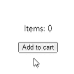
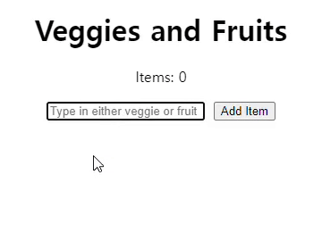

# When to useReducer

When we want to create and maintain dynamic state values within our React application (or frameworks based on React), the first hook that comes to our mind is the `useState` hook. However, people forget that there's another hook that functions similarly to the useState hook.

The **useReducer** hook.

When should we use the useReducer hook? We can use this hook when **maintaining state values with complex data structures**.


So for example, if your state value looks something like this:
```js
const user = {
  name: "Timothy",
  skills: ["javascript", "React", "NextJS", "Redux"],
  hobbies: [
    {name: "Piano", desc: "Played the piano for about 8 years"},
    {name: "Netflix", desc: "Favorite show is How I met your Mother"}
  ]
}
```

Then you should probably use the `useReducer` hook. Let's dive into it then.
<br><br>
## Da fundahmentals

Before we start coding with the useReducer hook, we must know three very important concepts to fully understand this hook.

**Dispatch, Action,** and **Reducer**.

<br>First, let's look at **Dispatch**.

In simple terms, when we say "dispatch", it means to demand a certain action to be executed. In frontend terms, we call this "dispatching an action object". It's simply **the action** of telling useReducer to do something.

<br>**Action**.

From the explanation above, I explained that **Dispatch** is simply the action of telling useReducer to execute a specific task. The **specific task** here would be the **Action**.

For example, let's say that we're in a e-commerce website. In this website's navbar, there is a shopping cart icon and the icon has a number indicating how many items are currently in the cart. Whenever we click on a button named "Add to cart", that number will change.

Clicking the button(EventHandler) would be the action of telling the app what to do. Hence, it would be **Dispatching** an action. Telling the app **what** to do (in this case, changing the number) would be the **Action**.

<br>**Reducer**

The **Reducer** will receive the action object and update the state.

<br><br>Let's visualize this process with code:

```jsx
import React, {useState, useReducer} from "react";

const reducer = (state, action) => {
  switch(action.type) {
    case "addItem":
      return state + 1;
    default:
      return state;
  }
}

const shoppingApp = () => {
  const [items, dispatch] = useReducer(reducer, 0)
  
  return (
    <div>
      
      <p>Items: {items}</p>
      
      ...
      
      <button onClick={() => {
        dispatch({type: "addItem"})
      }}>Add to cart</button>
    </div>
  )
}
```



When we click on the `Add to cart` button, the state changes successfully.

Now, let's break down the code.

<br>First, we must get familiarized with this syntax

```jsx
const [state, dispatch] = useReducer(reducer, initialState)
```

In the code above, we can see that the useReducer hook returns an array which holds the newly created state value and the `dispatch` function. Also, the useReducer hook itself accepts two parameters. The first one is the reducer function and the second one is the initial value of the set state. It will be confusing at first, but lets try to get this syntax to sink in.

So in our code above,

```jsx
const [items, dispatch] = useReducer(reducer, 0)
```

We have set (and named) our state as `items` and set its initial value to 0.

<br>Then we made the `reducer()` outside of our component.

```jsx
const reducer = (state, action) => {
  switch(action.type) {
    case "addItem":
      return state + 1
    default:
      return state
  }
}
```

We passed two parameters for this function. The `state` and the `action`. Also, we used the `switch` statement to handle our logic. This is part of our code where we tell the app **what** to do with the state.

<br>Finally, we added the `action.type` in our button.
```jsx
<button onClick={() => dispatch({type: "addItem"})}>Add to cart</button>
```

Now let's look at how to use the `useReducer` hook to maintain and change state values that have a more complex data structure.
<br><br>
## Using the `useReducer` hook for complex state value

In the beginning of this post, I stated that we should use the `useReducer` hook when we have to **maintain state values with complex data structures**. Let's dive right into it.

First, I want you to see the end result of the project we will be building (to explain this concept). This is a simple app where we can type in names of vegetables and fruits. When we click on the `Add Item` button, it will add that vegetable/fruit to the list below. When we click on the `Delete` button, it will erase the item from the list. There's also a `Items` counter which will increment and decrement according to the number of items on the list. Finally, when we click on the name of the item, the styles for the `textDecoration` value will change. Refer to the gif below.



To show use the **complex data structure** I've been talking about, this is our initial value of our state.

```js
const initialState = {
  count: 1, // This will start the counter from 1 as I've already added "tomato" on the list
  items: [
    { // adding in an example of an item to show you the data structure
      id: nanoid(5),
      name: "Tomato",
      isChecked: false
    }
  ]
};
```

<br><br>This state is somewhat more complex than the one we looked at above. Now let's look at the entire code.

```jsx
// App.js

import {useState, useReducer} from "react";
import {nanoid} from "nanoid";
import Item from "./Item.jsx";

const reducer = (state, action) => {
  switch(action.type) {
    case "addItem":
      const name = action.payload.name;
      const newItem = {
        id: nanoid(5), // limiting the characters to 5
        name,
        isChecked: false // setting default checked value to "false"
      }
      return {
        count: state.count + 1,
        items: [...state.items, newItem]
      }
    case "deleteItem":
      return {
        count: state.count - 1,
        items: state.items.filter((item) => item.id !== action.payload.id)
      };
    case "checkItem":
      return {
        count: state.count,
        items: state.items.map((item) => {
          if (item.id === action.payload.id) {
            return { ...item, isChecked: !item.isChecked };
          }
          return item;
        })
      };
    default:
      return state;
  }
}

const initialState = {
  count: 0,
  items: []
}

const ShoppingList = () => {

const [name, setName] = useState("")
const [itemsInfo, dispatch] = useReducer(reducer, initialState)

  return (
    <div>
      <h1>Veggies and Fruits</h1>
      <p>Items: {itemsInfo.count}</p>
      <input 
        value={name}
        onChange={(e) => setName(e.target.value)}
        placeholder="Type in either veggie or fruit"
        type="text"
      />
      <button onClick={() => dispatch({type: "addItem", payload: {name}})}>Add Item</button>
      {itemsInfo.items.map((item) => (
        <Item 
          name={item.name}
          key={item.id}
          dispatch={dispatch}
          id={item.id}
          isChecked={item.isChecked}
        />
      ))}
    </div>
  )
}
```

```jsx
// Item.jsx

const Item = ({ name, dispatch, id, isChecked }) => {
  return (
    <div>
      <span
        onClick={() => dispatch({ type: "checkItem", payload: { id } })}
        style={{
          textDecoration: isChecked ? "line-through" : "none",
          color: isChecked ? "gray" : "black"
        }}
      >
        {name}
      </span>
      <button onClick={() => dispatch({ type: "deleteItem", payload: { id } })}>
        Delete
      </button>
    </div>
  );
};

export default Item;
```
