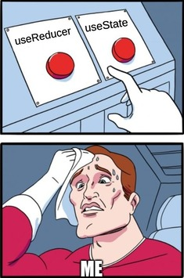

# When to useReducer

When we want to create and maintain dynamic state values within our React application (or frameworks based on React), the first hook that comes to our mind is the `useState` hook. However, people forget that there's another hook that functions similarly to the useState hook.

The **useReducer** hook.

When should we use the useReducer hook? We can use this hook when **maintaining state values with complex data structures**.



So for example, if your state value looks something like this:
```js
const user = {
  name: "Timothy",
  skills: ["javascript", "React", "NextJS", "Redux"],
  hobbies: [
    {name: "Piano", desc: "Played the piano for about 8 years"},
    {name: "Netflix", desc: "Favorite show is How I met your Mother"}
  ]
}
```

Then you should probably use the `useReducer` hook. Let's dive into it then.
<br><br>
## Da fundahmentals

Before we start coding with the useReducer hook, we must know three very important concepts to fully understand this hook.

**Dispatch, Action,** and **Reducer**.

<br>First, let's look at **Reducer**.
