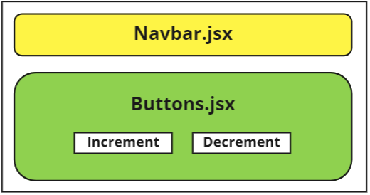

# State Management made easy - Redux Toolkit

Before redux, a long(?) time ago, it's been said that managing state in a React application was a big pain in the a**. 

How do we pass around a state value from component to component. Let's say that we have three components: A, B and C. A is the parent component of both B and C. If we want to pass a state value from B to C, we would first have to send the state from B to A. Then we can pass it down from A to C. Now, managing state in a project where there aren't many components is not that difficult. However, imagine your application size growing. The amount ot UI components will increase too. This will make passing props from one component to another cumbersome.


To solve this, **REDUX** was created. Simply stated, Redux is a state management library for Javascript apps like React. In their official website, they say that Redux can

>help you write applications that behave consistently, run in different environments (client, server, and native), and are easy to test. On top of that, it provides a great developer experience...

In this post, we will be looking into **Redux**, more specifically, **Redux Toolkit**. Redux toolkit is a "toolset" that helps Redux development to be more developer friendly. Also, Redux officially recommends using Redux toolkit in their documentation.

# Coding with Redux Toolkit

Let's make a simple counter app to learn the basics. Here is our component structure:



<br>Install the following npm packages

```bash
npm install @reduxjs/toolkit react-redux
```

<br>Next, we're going to make something called a Redux `store`. The `store` is something we will pass on to our root component (in a React application - index.js). Passing this to the root component will grant all components access to the states stored in Redux. We'll get to this later.

Let's make the `store`.
```js
// ./src/redux/store.js

import {configureStore} from "@reduxjs/toolkit";

export default configureStore({
  reducer: {}
})
```

Basically, in this file we're going to pass in the `reducer`. If you don't know what reducer is, refer to [this post](../React-Hook-useReducer/React-Hook-useReducer.md). The action(in this case - incrementing and decrementing the count) is passed to the reducer. We're going to make another file in the same folder named `counter.js`. In this file, we're going to code the logic of our action and export it. This is going to be imported from `store.js`. Finally, it's going to be passed on to the root of our project. It's no use just explaining this in text. We'll look deeper into this later on. For now, let's just remember to create a "store" file. 
